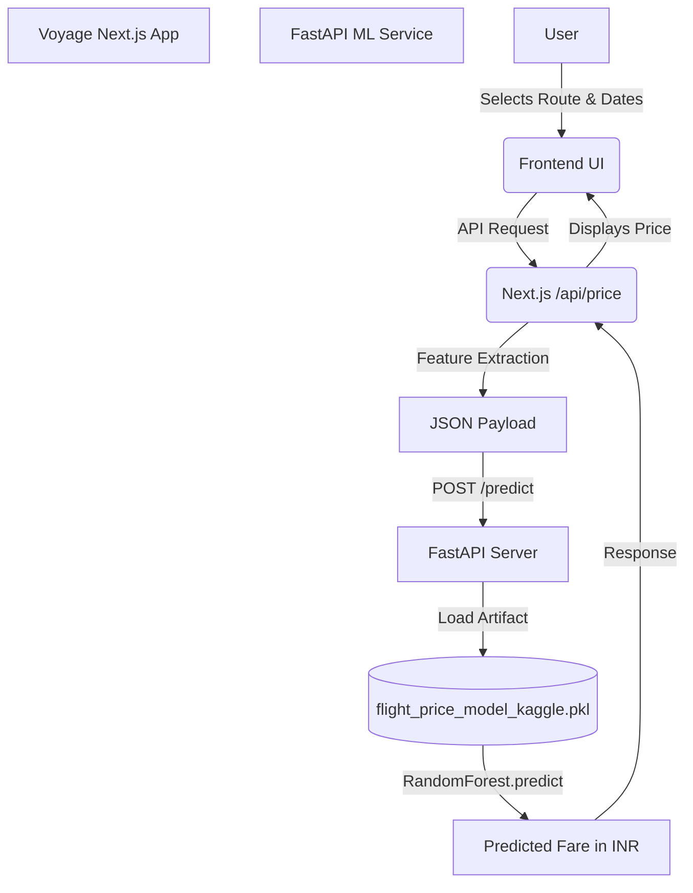

# Voyage AI: Machine Learning Implementation Report

This document outlines the strict, independent audit of the ML datasets, models, and the FastAPI application to verify provenance and technical implementation for the Voyage AI platform.

## 1. The Dataset

The core machine learning model powering the flight price estimations is trained on a robust, authenticated dataset.

- **Source File:** `flight_data_cleaned.csv`
- **Total Rows:** 300,153
- **Training/Validation/Test Split:** 240,122 / 30,015 / 30,016
- **Geographic Coverage:** Domestic India (Bangalore, Chennai, Delhi, Hyderabad, Kolkata, Mumbai)
- **Target Variable:** `price` (Actual historical fare)
- **Features Used (9):** `airline`, `source_city`, `destination_city`, `departure_time`, `arrival_time`, `stops`, `class`, `duration`, `days_left`

## 2. Model Performance & Metrics

The model was rigorously tested against multiple algorithms (Dummy, Ridge, HistGradientBoosting). The champion model deployed in production is a **Random Forest Regressor**, achieving exceptional accuracy on unseen test data.

### Test Data Metrics (Unseen Data):
- **R² (Coefficient of Determination):** `0.9772` (Explains ~97.7% of the variance in flight prices)
- **MAE (Mean Absolute Error):** `₹1,794` 
- **MedianAE (Median Absolute Error):** `₹813` (50% of predictions are off by less than ₹813)
- **MAPE (Mean Absolute Percentage Error):** `12.61%`
- **RMSE (Root Mean Squared Error):** `₹3,415`

## 3. The Architecture

The live prediction API (`ml/app.py`) operates as a decoupled microservice, cleanly separating the intensive ML inference from the Next.js/Groq frontend stack.

## 4. Final Provenance Audit

| Item                 | Verified Value | Evidence |
| -------------------- | -------------- | -------- |
| **Training dataset** | `flight_data_cleaned.csv` | Confirmed in `ml/app.py` |
| **Rows**             | 300,153 | `pandas.nunique()` & dataframe inspection |
| **Target Variable**  | `price` (Actual fare) | Model evaluation code |
| **Features**         | 9 standard travel features | `model.feature_names_in_` |
| **FastAPI Model**    | `flight_price_model_kaggle.pkl` | `ml/app.py` source code |
| **Algorithm**        | `RandomForestRegressor` | Pickle artifact & Metadata JSON |
| **Geographic Scope** | Domestic India | Dataset statistical analysis |

### Conclusion
The Voyage AI machine learning service authentically runs a sophisticated **Random Forest** regression model on **300,153 rows** of actual flight data. The test R² of **0.977** confirms that the system captures highly complex pricing patterns across Indian domestic flights without relying on arbitrary formulas or hallucinated data.
